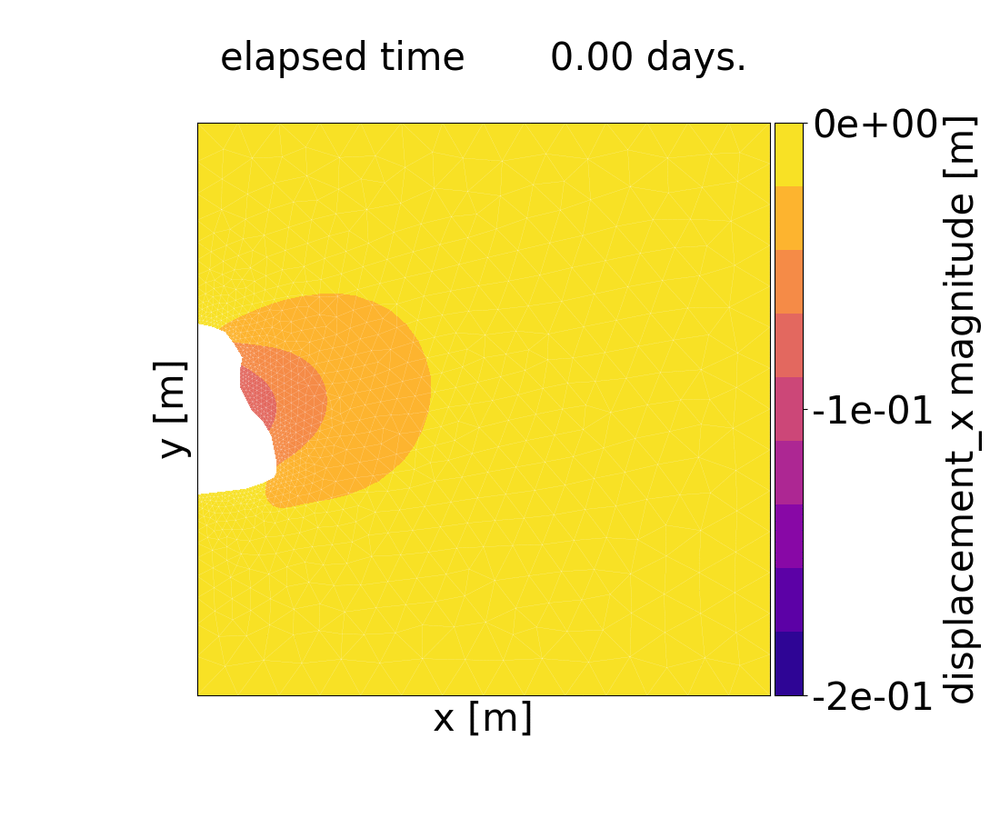

# Nonlinear 2D Finite Element Modeling: Cyclic Energy Storage in Salt Caverns with Creep Deformation Physics


### Introduction
The aim of this 2D Finite Element Method (FEM) based simulator is to calculate deformations and corresponding stress distribution in a salt cavern storage surronding due to a set of forces acting on the cavern's wall.

The capabilities of the simulator include quantification of displacement, strain and stress of linear elastic model, tertiary and secondary creep model, cyclic loading model, heterogeneous model and combination of the aforementioned models.

Input of the problem is given by a set of parameters, namely rock salt and overburden densities, depth of the roof of the cavern, temperature of the rock salt domain and set of material properties such as for example Young's modulus, Poisson ratio, creep exponent etc.

### Getting Started
Please follow these steps to be able to run this project:

 1. Install required dependencies. It is highly recommended to install all dependencies in `pipenv` virtual environment (see [guide](https://realpython.com/pipenv-guide/)) using the pipfile (see [guide](https://pipenv-fork.readthedocs.io/en/latest/basics.html)) to make sure that all necessary dependencies are installed and there are no conflicts in the libraries versions.

 2. Download [ParaView](https://www.paraview.org/) to see the results of the simulation (to open time series of every parameter saved in `*.xdmf` format).

 3. Decide which format you want to use for saving the simulation results: `*.xdmf`, `*.gif` or `*.png`. For example to save the results in the `*.xdmf` format, use the following:
     ```shell
     write_results(nt, mesh, output, filename.split(".")[0], '.xdmf')
     ```
     The results will be saved in the `~/output/mesh_filename/` folder of the project's root directory.

    If you want to save evolution of the calculated parameters in time for an arbitrary point A on the domain, use the following line:
     ```shell
     save_plot_A(nt, mesh, output, filename.split(".")[0], X)
     ```
     where X - is the index of the node of interest.

    You can also export the resulting set of every parameter to `*.xls` spreadsheet by using the following command:
     ```shell
     write_xls(filename, output)
     ```

 4. Run the `main.py` script from terminal with:
    ```shell
    python main.py
    ```
    or in your IDE.

### Structure of the code
The simulator is written in Finite Element Method Object Oriented Programming (FEMOOP) structure, which means that the FEM routine is implemented using classes and methods. The main classes, that form the engine of the simulator are contained in the `classes.py` library and namely are:

 1. class `Mesh()` - Instance of this class is an object with mesh parameters, such as nodal coordinates, nodal indexes, element indexes, cavern wall nodes indexes etc.

 2. class `Shapefns()` - Instance of this class is an object with shape functions and their derivatives values at local coordinates of an arbitrary finite element (fe).

 3. class `FiniteElement()` - Instance of this class is an object which represents fe. The methods of this class are used to access such parameters of a particular fe as corner points indexes and coordinates, area, transformation matrix from global to local coordinates (Jacobian matrix), values of derivatives of shape functions on this element as well as mechanical properties and elasticity tenzor.

 4. class `FunctionSpace()` - Instance of this class is an object that contains list of all fe of the domain with corresponding properties. Methods of the class allow to generate strain-displacement matrix `strain_disp_matrix()`, global stiffness matrix `stiff_matrix()`, vector of external loads `load_vector()` and vector of fictitious creep forces `creep_load_vector()` which are required to solve the problem. Apart from the aforementioned methods, instance of `FunctionSpace()` class contains processing methods such as Gauss strain and stress calculation `gauss_strain()`, `gauss_stress()`, method which allows to extrapolate the aforementioned Gauss strains and stresses to nodal points `nodal_extrapolation()` and methods that are used to implement Newmann boundary conditions (NBC) on the cavern's wall: method that extracts the indexes of the cavern nodes `cavern_nodes_ind()` and method that implements the NBC at these nodes `nodal_forces()`.
